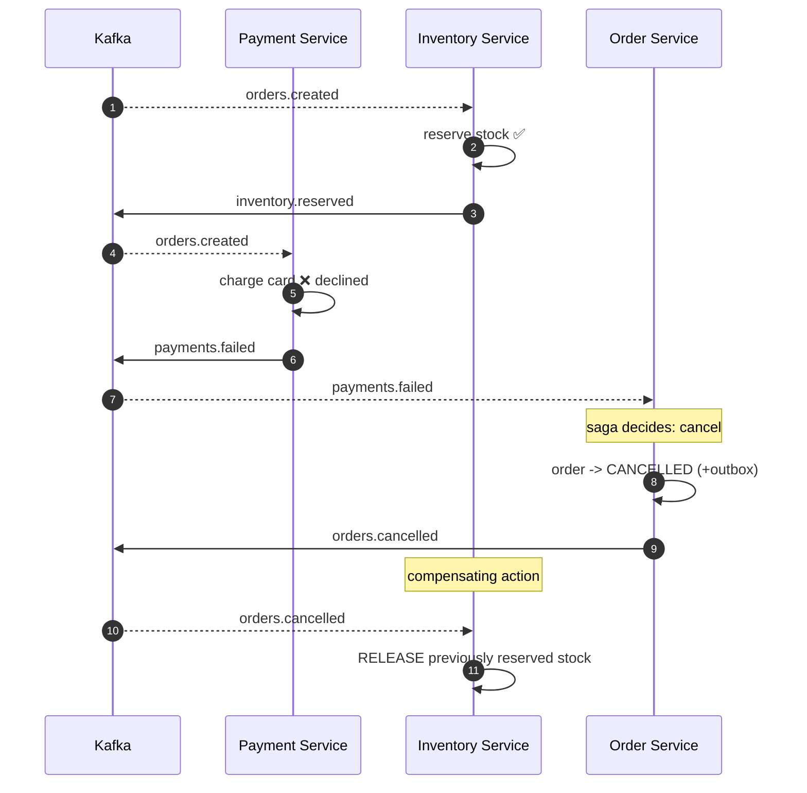

# Checkout — Failure Path (Saga Compensation)

Inventory reserves stock, but payment is declined. The saga compensates: the
order is cancelled and the reserved stock is **released**.

**Key points**
- The compensation (releasing stock) is itself an **idempotent** consumer — if
  `orders.cancelled` is redelivered, stock is released only once.
- Order of arrival doesn't matter: whether payment fails before or after the
  reservation, the end state converges to CANCELLED + stock released.
- This is **eventual consistency** — there's a brief window where stock is
  reserved for an order that will be cancelled. Acceptable for checkout.
